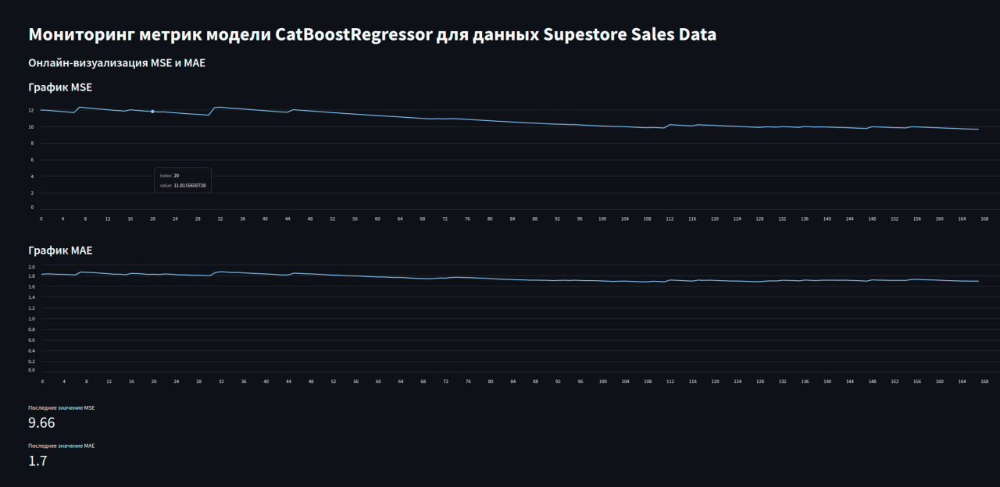

# Описание лабораторной работы №1

## Описание задачи

Датасет взят из: https://www.kaggle.com/datasets/rohitsahoo/sales-forecasting.
Набор данных розничной торговли глобального супермаркета за 4 года. Необходимо предсказать продажи(задача Регресии). В качестве модели рассматривался градбуст(CatBoostRegressor).

## Основные компоненты
Создаются 2 брокера: Kafka Broker 1 и Kafka Broker 2.
Используются 3 продюсера и 3 консюмера: 
* Raw data producer / consumer
* Preprocessing data producer / consumer
* ML producer / consumer

Соответственно используются 3 топика:  *Produce Row Data*, *Produce Preprocessed Data*, *ML Topic*

##  Запуск
```
docker-compose up -d
pip3 install -r requirements.txt
```
Далее в отдельных терминалах необходимо запустить следующее:
```
python3 produce_raw_data.py
python3 preprocessing.py
python3 ML.py
python3 app.py
```
Для завершения необходимо убить все раннее запущенные python-процессы (``Ctrl + C)``
## Результат
Streamlit Dashboard находится на: http://localhost:8501

