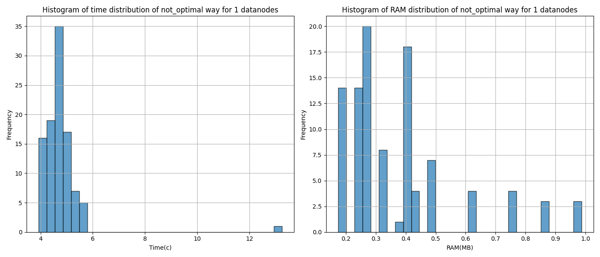
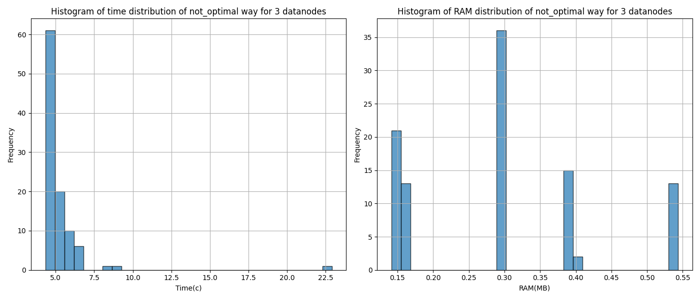
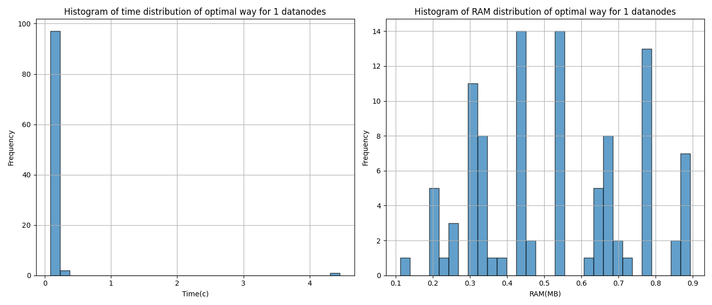
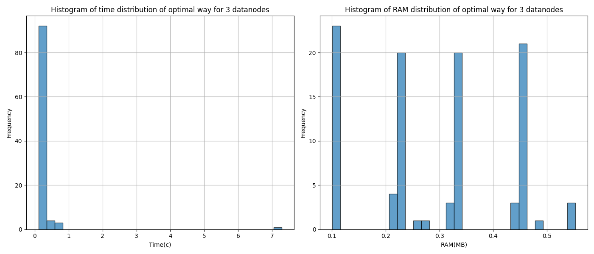

# Описание лабораторной работы №2
## Данные 

Взят [Diabetes Prediction Dataset](https://www.kaggle.com/datasets/iammustafatz/diabetes-prediction-dataset/data). Этот датасет содержит информацию, связанную с **риском развития диабета** у пациентов. Он используется для задач бинарной классификации.  Набор данных содержит 100000 сэмплов и 9 признаков.   
**Цель** — предсказать, есть ли у пациента диабет (**1**) или нет (**0**), на основе медицинских и демографических признаков.

## Модель
Использовался `pyspark.ml.classification.RandomForest` случайный лес для классификации. Код обучения приведен в `utils.py`.

## Структура 
```										
├── 📂 src	
│   ├── 🐍 utils.py
│   ├──	🐍 app.py				
│   └── 🐍 app_optimal.py	
├── 📄 hadoop.env
├── 🐳 Dockerfile				
├── 🐙 docker-compose-3d.yml
├── 🐙 docker-compose.yml					
├── 📂 data							
│   └── 📊 diabetes_prediction_dataset.csv						
├── 📂 results		
└── 📝 README.md				
```

## Spark-Приложения 
В работе используются spark-приложения: с параллелизацией вычислений `app_optimal.py` и без `app.py`. Внутри приложения мы делаем три шага: препроцессинг, обучение и оценку качества.
```
df = data_preprocess(df)
predictions = train_process(df)
accuracy = evaluate(predictions)
```

## Запуск
###  1 DataNode

```
docker-compose -f docker-compose.yml up -d
```
Загружаем данные в hdsf (необходимо скопировать датасет из директории `data`  в hdsf):
```
docker cp data/diabetes_prediction_dataset.csv namenode:/ 
docker exec -it namenode bash
hdfs dfs -put diabetes_prediction_dataset.csv /
```

Чтобы запустить приложения, для начала добавим необходимые скрипты из `src` на контейнер `spark-master`: 
```
docker cp -L src/. spark-master:/opt/bitnami/spark/
```
Запустим командой ниже процесс обучения в кол-ве 100 итераций и отрисовку графиков. Через `--data-path` указываем путь к файлу в hdfs.

`app.py` для неоптимизированного приложения:
```
docker exec -it spark-master spark-submit --master spark://spark-master:7077 app.py --data-path hdfs://namenode:9000/diabetes_prediction_dataset.csv
```
`app_optimal.py` для оптимизированного: 
```
docker exec -it spark-master spark-submit --master spark://spark-master:7077 app_optimal.py --data-path hdfs://namenode:9000/diabetes_prediction_dataset.csv
```

Чтобы достать графики и положить их в `results`, введем две команды:
```
docker cp spark-master://opt/bitnami/spark/optimal_with_1_datanodes.png results
docker cp spark-master://opt/bitnami/spark/not_optimal_with_1_datanodes.png results
```
### 3 DataNodes
Чтобы протестировать с тремя нодами после предыдущего шага сначала опустить текущие контейнеры и поднять для 3-х нод:
```
docker-compose -f docker-compose.yml down
docker-compose -f docker-compose-3d.yml up -d
```

Проверим, что данные лежат в hdfs. 
```
docker exec -it namenode bash
hdfs dfs -ls / # тут должен быть diabetes_prediction_dataset.csv файл
ИЛИ
docker exec -it namenode bash
hdfs dfs -put diabetes_prediction_dataset.csv / # должны получить put: `/diabetes_prediction_dataset.csv': File exists
```
Если данных нет, то необходимо выполнить команды для случая с **1 DataNode**.

Так же скопируем необходимые скрипты из `src` на контейнер `spark-master`: 
```
docker cp -L src/. spark-master:/opt/bitnami/spark/
```

И запустим команды

`app.py` для неоптимизированного приложения:
```
docker exec -it spark-master spark-submit --master spark://spark-master:7077 app.py --data-path hdfs://namenode:9000/diabetes_prediction_dataset.csv --datanodes 3
```
`app_optimal.py` для оптимизированного приложения: 

```
docker exec -it spark-master spark-submit --master spark://spark-master:7077 app_optimal.py --data-path hdfs://namenode:9000/diabetes_prediction_dataset.csv --datanodes 3
```
Чтобы достать графики и положить их в `results`, введем две команды:
```
docker cp spark-master://opt/bitnami/spark/optimal_with_3_datanodes.png results
docker cp spark-master://opt/bitnami/spark/not_optimal_with_3_datanodes.png results
```

### Результаты
Ниже представлены результаты, сколько времени и памяти на 100 итераций занимает такая операция обучения и оценки для оптимизированного и неоптимизированного приложений.





